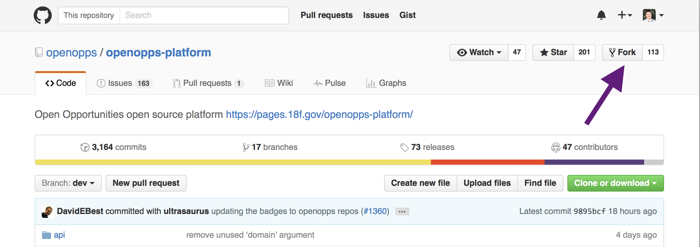
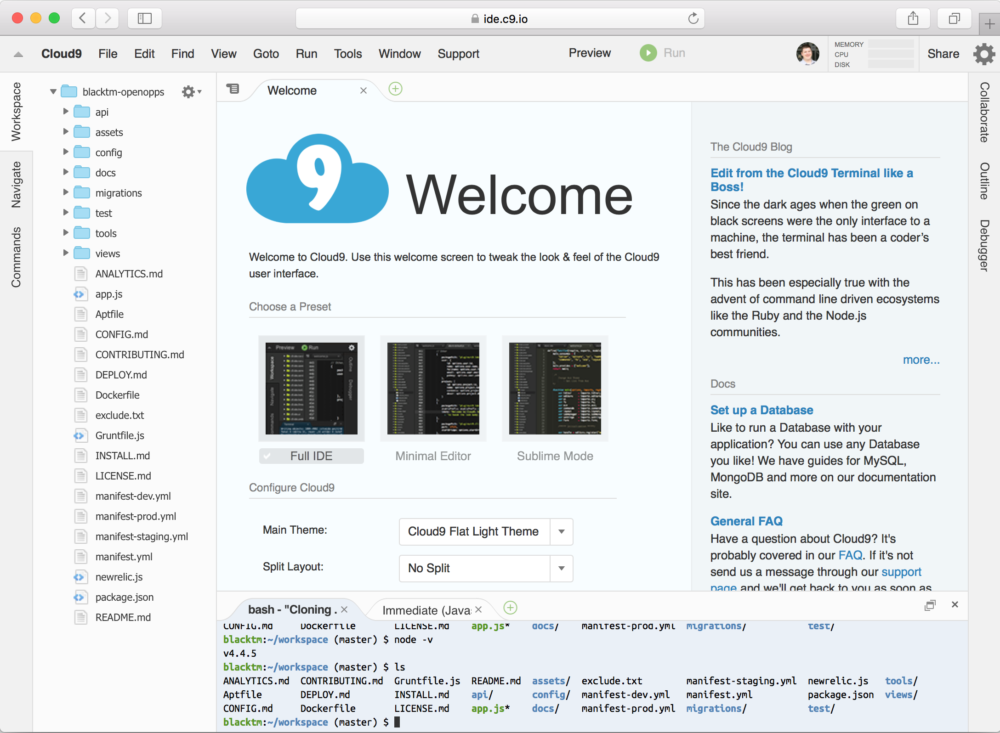

Get Started With Cloud 9
========================

1. Create a github account
2. Fork the project: https://github.com/openopps/openopps-platform

  

3. Sign up for [Cloud9](https://c9.io)

  

4. Create a new Cloud 9 workspace, use `openopps` as the workspace name (and you can leave the description blank)

  

  use the github URL from your fork, and choose the Node.js template:

  

4. The Cloud9 workspace should look like this:

  

  Notice that the list of files on the left are the same files that were on github.  

5. We just created a virtual machine with a real-live unix terminal. At the bottom, you can see a terminal window, where you can type unix commands. Try these:

  ```
  ls
  ```
  `ls` is short for "list" which will display a list of files in the current directory. You should see something like this:

  ```
  Aptfile          GOVERNANCE.md  README.md  config/           manifest-new.yml      migrations/    tasks/
  CONFIG.md        Gruntfile.js   api/       docs/             manifest-prod.yml     newrelic.js    test/
  CONTRIBUTING.md  INSTALL.md     app.js     exclude.txt       manifest-staging.yml  node_modules/  tools/
  CORETEAM.md      LICENSE.md     assets/    manifest-dev.yml  manifest.yml          package.json   views/
  ```

  To check the version of Nodejs you are running:

  ```
  node -v
  ```
6. Next, start PostgreSQL which will allow our app to access a database:

  ```
  sudo service postgresql start
  ```

  you should see:

  ```
  * Starting PostgreSQL 9.3 database server
   ...done.
  ```

7. Create the database:

  ```
  createdb midas
  ```

8. Now we need to set up permissions using the `psql` command line tool:

  ```
  psql midas
  ```

  You shoudl see the following output:
  ```
  psql (9.3.13)
  Type "help" for help.
  ```

9. The following commands are SQL which will make it so the app has permissions to access the database we just created (these are each separate commands, but you can paste them in as a block of text):

  ```
  CREATE USER midas WITH PASSWORD 'midas';
  GRANT ALL PRIVILEGES ON DATABASE midas to midas;
  ALTER SCHEMA public OWNER TO midas;
  ```

  then you should see something like this:
  ```
  midas=# CREATE USER midas WITH PASSWORD 'midas';
  CREATE ROLE
  midas=# GRANT ALL PRIVILEGES ON DATABASE midas to midas;
  GRANT
  midas=# ALTER SCHEMA public OWNER TO midas;
  ALTER SCHEMA
  midas=#
  ```

10. Quit the `psql` tool:
```
\q
```

11. Now, we have a couple of tools that need to be installed globally.  On the command-line:

  ```
  npm install -g node-gyp grunt-cli
  ```

12. Then we can use the node package manager (npm) to install everything else:

  ```
  npm install
  ```

13. Initialize some data that is needed by the app:

  ```
  npm run init
  ```

  After a lot of output, you should see:

```
  info:
  info:
  info:    Sails              <|
  info:    v0.10.5             |\
  info:                       /|.\
  info:                      / || \
  info:                    ,'  |'  \
  info:                 .-'.-==|/_--'
  info:                 `--'-------'
  info:    __---___--___---___--___---___--___
  info:  ____---___--___---___--___---___--___-__
  info:
  info: Server lifted in `/home/ubuntu/workspace`
  info: To see your app, visit http://localhost:8080
  info: To shut down Sails, press <CTRL> + C at any time.

  debug: --------------------------------------------------------
  debug: :: Sun Jun 05 2016 21:27:08 GMT+0000 (UTC)

  debug: Environment : development
  debug: Port        : 8080
  debug: --------------------------------------------------------
  ```

14. Click "http://localhost:8080" and then "Open" in the menu, and a new tab will open. With a URL that looks something like: http://openopps-yourgithubusername.c9users.io:8080
